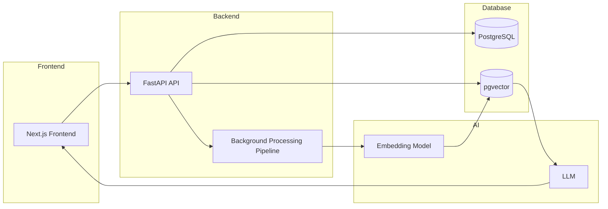

# AI-powered Document Intelligence Platform

A full-stack AI application that ingests documents, builds vector embeddings, performs semantic search, and answers questions using Retrieval-Augmented Generation (RAG).

---

## Problem Overview

Organizations store large amounts of knowledge in documents, notes, and reports. Traditional keyword search struggles to find relevant information when different wording or terminology is used.

AI Knowledge Tracker transforms unstructured text into a searchable knowledge base by:

- Uploading documents and notes
- Processing content asynchronously through an AI pipeline
- Generating vector embeddings
- Performing semantic (meaning-based) search
- Answering natural language questions using Retrieval-Augmented Generation (RAG)

The project demonstrates how modern AI applications combine backend engineering, vector databases, asynchronous processing, and LLMs into a production-style architecture.

---
## What This Project Demonstrates

This project showcases production-oriented AI engineering skills across the full stack:

- FastAPI backend development
- React/Next.js frontend development
- PostgreSQL and pgvector
- SQLAlchemy ORM
- Background processing pipelines
- Vector embeddings
- Semantic search
- Retrieval-Augmented Generation (RAG)
- Clean architecture (Service, Repository, Provider, Factory patterns)
- End-to-end AI application development

---

## Architecture

**Backend Stack:**

* FastAPI (API layer)
* SQLAlchemy ORM (data layer)
* Alembic (database migrations)
* PostgreSQL + pgvector (vector storage)
* Background Tasks (document processing pipeline)
* OpenRouter API
* Pydantic v2

**Frontend Stack:**

* Next.js
* React
* TypeScript
* Tailwind CSS

**AI Components:**

* OpenRouter Chat Models
* OpenRouter Embedding Models
* Provider Factory Pattern
* Retrieval-Augmented Generation (RAG)
* Vector Similarity Search
  
**Design Patterns:**

* Service Layer Pattern
* Repository Pattern
* Dependency Injection
* Provider Pattern
* Factory Pattern

**High-Level Flow:**



---

## AI Processing Pipeline

```text
EXTRACT
  |
CLEAN
  |
CHUNK
  |
EMBED
  |
DONE
```

Each pipeline execution creates a new job and records stage-level events for complete observability.

The pipeline supports:

- Background execution
- Stage tracking
- Job history
- Event timeline
- Pipeline reruns
- Failure recovery
- Progress reporting

---

## Current Features:

**Document Management**
- Upload text documents
- Drag-and-drop upload
- Create notes
- Document dashboard
- Document detail view
- Processing status indicators

**AI Pipeline**
- Background document processing
- Text cleaning
- Overlap-aware chunking
- Embedding generation
- pgvector storage
- Pipeline reruns

**Search**
- Semantic search
- Similarity scoring
- Relevant chunk retrieval
- Search results linked to source documents

**AI Question Answering**
- Retrieval-Augmented Generation (RAG)
- Context-aware responses
- Source chunk retrieval
- OpenRouter-powered LLM responses

**Observability**
- Job history
- Pipeline stage tracking
- Event logging
- Processing banner
- Status dashboard
- Embedding progress visualization
  
---

## RAG Workflow:
```text
User Question
      │
Generate Query Embedding
      │
Vector Search
      │
Retrieve Top-k Chunks
      │
Prompt Construction
      │
OpenRouter LLM
      │
Final Answer
```
---

## Running Locally

### 1. Clone repo

```
git clone <your-repo-url>
cd ai-knowledge-tracker
```

---

### 2. Setup backend environment

```bash
cd backend
python -m venv venv
source venv/bin/activate
pip install -r requirements.txt
```

---

### 3. Setup frontend dependencies

```bash
cd frontend
npm install
```

---

### 4. Start PostgreSQL (Docker)

```bash
docker compose up -d
```

The project uses PostgreSQL with the pgvector extension for vector similarity search.

---

### 6. Run migrations

```bash
alembic upgrade head
```

---

### 7. Start Backend Server

```bash
uvicorn app.main:app --reload
```

---

### 8. Start frontend

Open another terminal:

```bash
cd frontend
npm run dev
```

Frontend available at:

```text
http://localhost:3000
```
---


## Design Decisions

### Document Processing
- Documents are immutable inputs.
- Processing occurs asynchronously.
- Long-running work never blocks API requests.

### Job Model

- One document can have many jobs.
- Each processing run creates a new job.
- Historical jobs are preserved.

### Event Tracking

Every pipeline stage generates events:
- Started
- Completed
- Failed

This enables complete execution history and debugging.

### Chunk Strategy

- Overlap-aware chunking
- Previous chunks replaced on reprocessing
- Embeddings regenerated from current content

### Provider Abstraction

The application separates AI providers from business logic.

Current implementation:

- OpenRouter Chat Provider
- OpenRouter Embedding Provider

This design allows future providers (OpenAI, Azure, Ollama, etc.) to be added without changing application logic.

---

## Future Enhancements
**AI**
* Multi-document conversations
* Streaming responses
* Conversation memory
* Hybrid keyword + semantic search
* Metadata filtering
* Citation highlighting

**Platform**
* PDF ingestion
* DOCX support
* URL ingestion
* OCR support
* Authentication
* Multi-user workspaces

**Infrastructure**
- Celery/RQ workers
- Message queues
- Microservice ingestion pipeline
- Kubernetes deployment
- CI/CD pipeline
Cloud deployment


---

## Author

GitHub: https://github.com/lois2inn
