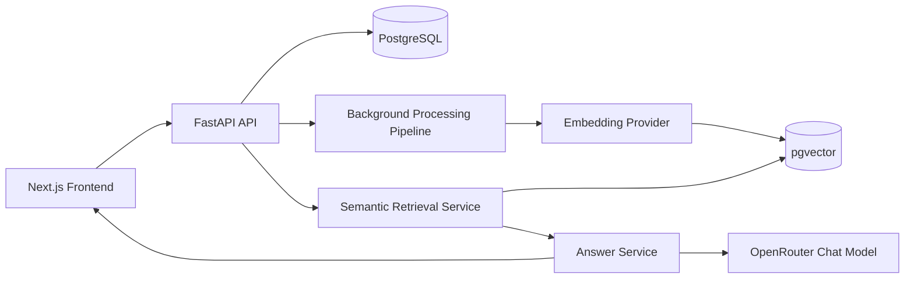
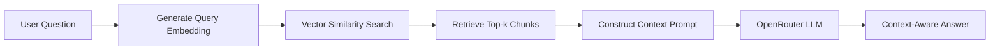

  


A production-oriented full-stack AI application demonstrating document ingestion, vector search, and Retrieval-Augmented Generation (RAG).

---
## Project Highlights

- Retrieval-Augmented Generation (RAG)
- Semantic search using pgvector
- Asynchronous document ingestion
- FastAPI + Next.js full-stack architecture
- PostgreSQL + pgvector embeddings
- Clean architecture (Service, Repository, Provider, Factory)

---

<details>
<summary><strong>Table of Contents</strong></summary>

- [Problem Overview](#problem-overview)
- [What This Project Demonstrates](#what-this-project-demonstrates)
- [Architecture](#architecture)
  - [High-Level Flow](#high-level-flow)
- [AI Processing Pipeline](#ai-processing-pipeline)
- [Application Features](#application-features)
- [RAG Workflow](#rag-workflow)
- [API Endpoints](#api-endpoints)
- [Running Locally](#running-locally)
- [Design Decisions](#design-decisions)
  - [Document Processing](#document-processing)
  - [Job Model](#job-model)
  - [Event Tracking](#event-tracking)
  - [Chunk Strategy](#chunk-strategy)
  - [Provider Abstraction](#provider-abstraction)
- [Future Enhancements](#future-enhancements)
- [Author](#author)

</details>


---

## Problem Overview

Organizations store large amounts of knowledge in documents, notes, and reports. Traditional keyword search struggles to find relevant information when different wording or terminology is used.

AI Knowledge Tracker transforms unstructured text into a searchable knowledge base by:

- Uploading documents and notes
- Processing content asynchronously through an AI pipeline
- Generating vector embeddings
- Performing semantic (meaning-based) search
- Answering natural language questions using Retrieval-Augmented Generation (RAG)

The project demonstrates how modern AI applications combine backend engineering, vector databases, asynchronous processing, and LLMs into a modular, production-oriented architecture.


---
## What This Project Demonstrates

This project showcases production-oriented AI engineering skills across the full stack:

- FastAPI backend development
- React/Next.js frontend development
- PostgreSQL and pgvector
- SQLAlchemy ORM
- Background processing pipelines
- Vector embeddings
- Semantic search
- Retrieval-Augmented Generation (RAG)
- Clean architecture (Service, Repository, Provider, Factory patterns)
- End-to-end AI application development

---


## Architecture

**Backend Stack:**

* FastAPI (API layer)
* SQLAlchemy ORM (data layer)
* Alembic (database migrations)
* PostgreSQL + pgvector (vector storage)
* Background Tasks (document processing pipeline)
* OpenRouter API
* Pydantic v2

**Frontend Stack:**

* Next.js
* React
* TypeScript
* Tailwind CSS

**AI Components:**

* OpenRouter Chat Models
* OpenRouter Embedding Models
* Provider Factory Pattern
* Retrieval-Augmented Generation (RAG)
* Vector Similarity Search
  
**Design Patterns:**

* Service Layer Pattern
* Repository Pattern
* Dependency Injection
* Provider Pattern
* Factory Pattern

### High-Level Flow:



---

## AI Processing Pipeline


Each pipeline execution creates a new job and records stage-level events for complete observability.

The pipeline supports:

- Background execution
- Stage tracking
- Job history
- Event timeline
- Pipeline reruns
- Failure recovery
- Progress reporting


---

## Application Features

**Document Management**
- Upload `.txt` and `.rtf` documents
- Drag-and-drop upload
- Create notes
- Document dashboard
- Document detail view
- Processing status indicators


**AI Pipeline**
- Background document processing
- Text cleaning
- Overlap-aware chunking
- Embedding generation
- pgvector storage
- Pipeline reruns

**Search**
- Semantic search
- Similarity scoring
- Relevant chunk retrieval
- Search results linked to source documents


**AI Question Answering**
- Retrieval-Augmented Generation (RAG)
- Context-aware responses
- Source chunk retrieval
- OpenRouter-powered LLM responses


**Observability**
- Job history
- Pipeline stage tracking
- Event logging
- Processing banner
- Status dashboard
- Embedding progress visualization
  
---

## RAG Workflow

---

## API Endpoints

POST /documents/upload

POST /documents

GET /documents/{id}

POST /search/semantic

POST /ask

---

## Running Locally

### 1. Clone repo

```bash
git clone https://github.com/lois2inn/AI-Document-Intelligence-Platform.git
cd AI-Document-Intelligence-Platform
```

---

### 2. Configure environment variables

Create backend/.env 
```env
DATABASE_URL=postgresql+psycopg://<postgres_username>:<postgres_password>@localhost:5432/ai_knowledge_tracker
OPENROUTER_API_KEY=your_openrouter_api_key
EMBEDDING_MODEL=your_embedding_model
CHAT_MODEL=your_chat_model
```
A sample .env file is shown in backend/example.env

Create `frontend/.env.local`:
```env
NEXT_PUBLIC_API_BASE_URL=http://localhost:8000
```

---

### 3. Start PostgreSQL (Docker)

```bash
cd backend
docker compose up -d
```
This command only works if compose.yaml is inside backend folder. If compose.yaml is at the repository root, run the docker commands there.

---

### 4. Setup backend environment

The current working directory should be backend folder.
```bash
python -m venv venv
source venv/bin/activate
pip install -r requirements.txt
```

---

### 5. Run migrations

```bash
alembic upgrade head
```

---

### 6. Start backend
```bash
uvicorn app.main:app --reload
```

---

### 7. Setup frontend dependencies

Open another terminal: Go to repository root.
```bash
cd frontend
npm install
```

---

### 8. Start frontend

```bash
npm run dev
```

The app will be available at:

```text
http://localhost:3000
```
---


## Design Decisions

### Document Processing
- Original document inputs are preserved.
- Derived text, chunks, and embeddings can be regenerated through reprocessing.
- Processing occurs asynchronously.
- Long-running work never blocks API requests.

### Job Model

- One document can have many jobs.
- Each processing run creates a new job.
- Historical jobs are preserved.

### Event Tracking

Every pipeline stage generates events:
- Started
- Completed
- Failed

This enables complete execution history and debugging.

### Chunk Strategy

- Overlap-aware chunking
- Previous chunks replaced on reprocessing
- Embeddings regenerated from current content

### Provider Abstraction

The application separates AI providers from business logic.

Current implementation:

- OpenRouter Chat Provider
- OpenRouter Embedding Provider

This design allows future providers (OpenAI, Azure, Ollama, etc.) to be added without changing application logic.

---

## Future Enhancements
**AI**
* Multi-document conversations
* Streaming responses
* Conversation memory
* Hybrid keyword + semantic search
* Metadata filtering
* Citation highlighting

**Platform**
* PDF ingestion
* DOCX support
* URL ingestion
* OCR support
* Authentication
* Multi-user workspaces

**Infrastructure**
- Celery/RQ workers
- Message queues
- Microservice ingestion pipeline
- Kubernetes deployment
- CI/CD pipeline
- Cloud deployment


---

## Author

GitHub: https://github.com/lois2inn
